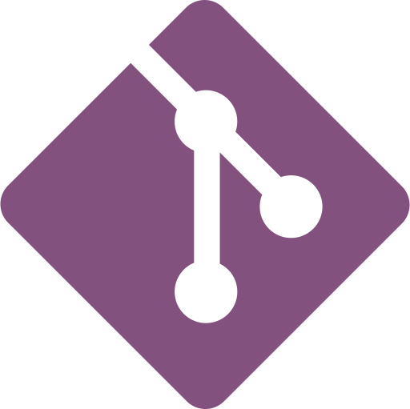

<h2 align="center">✨ Hola, I'm Celia! ✨</h2>

I am a <b>Front-End Developer</b> contributing to change the world by coding.

I use:

   <b>JavaScript | React | HTML | CSS | SASS | Git | InDesign | Figma</b>

I am also: 
<b>Learning new dev things non-stop</b> || A good <b>communicator</b> || VERY <b>organized</b>

I like: 
Good books & spicy food || Nina Simone || Adventuring

<h3 align="center">Find me on:<h3>

