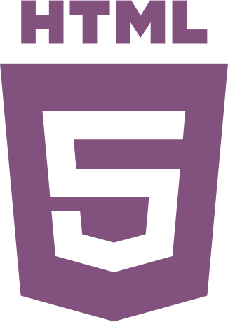

<h1 align="center">✨ Hola, I'm Celia! ✨</h1>

I am a <b>multilingual Software Developer</b> passionate about contributing to projects that drive positive change.

I work in the front end with:

  <b>JavaScript | React | HTML | CSS | Material-UI </b>

And in the back end with: 
<b>Python | Django | Django REST Framework | PostgreSQL</b>

I am also: 
<b>Learning new things</b> non-stop | A good <b>communicator</b> | VERY <b>organized</b>

I like: 
Good books | Nina Simone | Travelling

<h3 align="center">Find me on:<h3>

  
  

